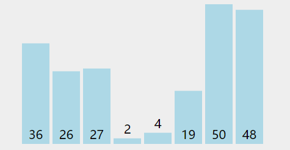

1. 排序算法是一种将一组元素按照特定顺序重新排列的算法，大概分为

## 1.冒泡排序
1. 冒泡排序（Bubble Sort）是一种简单的排序算法，它重复地遍历要排序的列表，一次比较两个元素，并且如果它们的顺序错误就把它们交换过来
- 从列表的第一个元素开始，依次比较相邻的两个元素。
- 如果顺序不正确（即较大的在前面），则交换这两个元素。
- 继续遍历列表，重复步骤1和步骤2，直到列表末尾。
- 一轮遍历后，最大的元素会移动到列表末尾。
- 重复以上步骤，每次遍历都将未排序部分的最大元素移动到正确的位置。
- 当没有需要交换的元素时，排序完成。



2. 代码入下，复杂度O(n^2)
```js
let arr = [10, 4, 8, 18, 11, 2]
let length = arr.length
// 外层是次数
for (let i = length - 1; i > 0; i--) {
  // 内层进行比较
  for (let j = 0; j < i; j++) {
    // 如果前面一个大于后面一个则交换位置
    if (arr[j] > arr[j + 1]) {
      let temp = arr[j + 1]
      arr[j + 1] = arr[j]
      arr[j] = temp
    }
  }
}
```


## 2.选择排序
1. 选择排序：它的基本思想是在未排序的部分中选择最小的元素，然后将其放到已排序部分的末尾。这个过程一直重复，直到整个数组都被排序
- 初始状态： 将整个数组分为已排序部分和未排序部分，初始时已排序部分为空。
- 遍历未排序部分： 在未排序部分中找到最小的元素，记住它的索引。
- 交换： 将找到的最小元素与未排序部分的第一个元素交换位置，将最小元素加入已排序部分。
- 重复： 重复步骤2和步骤3，直到未排序部分为空。
- 完成： 当未排序部分为空时，整个数组就被排序完成。


2. 代码入下，复杂度O(n^2)
```js
let arr = [10, 4, 8, 18, 11, 2]
let length = arr.length
for (let j = 0; j < arr.length; j++) {
  let min = j
  for (let i = min + 1; i < length; i++) {
    if (arr[min] > arr[i]) {
      min = i
    }
  }
  let temp = arr[j]
  arr[j] = arr[min]
  arr[min] = tem
}
```

## 3.插入排序