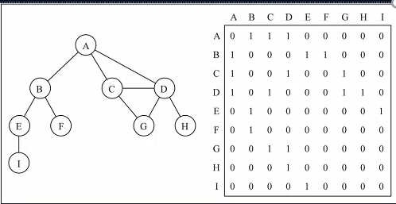
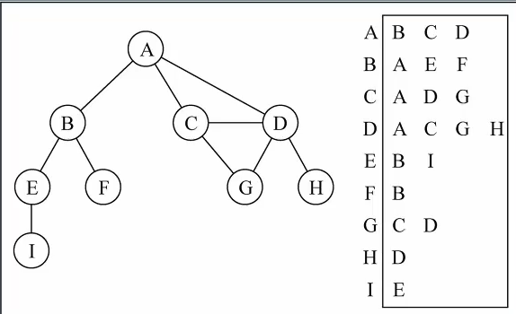
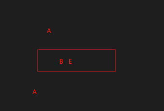

## 1.图
1. 图是由节点（顶点）和连接这些节点的边（边缘）组成的数据结构，可以用邻接矩阵与邻接表来表示图，下面是图的一些概念
- 顶点： 图中的基本单元，通常用圆圈或点表示。
- 边： 连接两个顶点的线段，表示顶点之间的关系。
- 有向图： 边有方向的图，即从一个顶点到另一个顶点有一个明确的方向。
- 无向图： 边没有方向的图，即连接两个顶点的边没有箭头。
- 权重： 与边相关联的数值，表示该边的权重或成本。
- 路径： 顶点序列，其中任意两个相邻的顶点都由一条边连接。
- 环： 一条路径形成的闭合回路，起点和终点相同。
- 度数： 顶点相连的边的数量，入度和出度分别表示有向图中指向和从顶点出发的边的数量。

2. 邻接矩阵



3. 邻接表




## 2.图的封装
1. 通过邻接表来封装
- addVertexts：添加顶点
- addEdges：添加边
- toString：获取所有边
```js
class Graph {
  constructor() {
    this.vertexes = [] // 顶点
    this.edges = Object.create(null) // 边
  }
  // 添加节点
  addVertexts() {
    for (let i = 0; i < arguments.length; i++) {
      const v = arguments[i]
      this.vertexes.push(v)
      this.edges[v] = []
    }
  }
  // 添加边
  addEdges(v1, v2) {
    // console.log(this.vertexes)
    // console.log(this.edges)
    this.edges[v1].push(v2) // 其他节点
    // this.edges[v2].push(v1) // 自己节点
  }
  // 获取所有边
  toString() {
    let str = ''
    for (let i = 0; i < this.vertexes.length; i++) {
      const key = this.vertexes[i]
      const item = this.edges[key]
      for (let j = 0; j < item.length; j++) {
        str += (key + '=>' + item[j]) + ','
      }
    }
    // console.log(str)
    return str.slice(0, -1)
  }
  // 初始化状态
  initStatus() {
    // white 没有访问  gray 访问了没有探索 black既访问了又探索了
    const colors = {}
    for (let i = 0; i < this.vertexes.length; i++) {
      colors[this.vertexes[i]] = 'white'
    }
    return colors
  }
  // 广度优先搜索
  bfs(initV, handler) {
    // 1.初始状态
    let colors = this.initStatus()
    console.log(colors)
    // 2.把顶点放进队列
    const queue = [initV]
    while (queue.length) {
      // 3.1开始探索
      const cur = queue.shift()
      colors[cur] = 'gray'
      // 3.2寻找子节点
      const chilren = this.edges[cur]
      for (let i = 0; i < chilren.length; i++) {
        // 白色未被访问
        if (colors[chilren[i]] == 'white') {
          queue.push(chilren[i])
          // 已访问未探索
          colors[chilren[i]] = 'gray'
        }


      }
      // 3.2探索完毕
      colors[cur] = 'black'
      // 4.处理节点
      handler(cur, this.edges[cur])
    }
    console.log(colors)
  }
  // 深度优先搜索，需要先定义递归函数
  dfs(initV, handler) {
    // 1.初始状态
    let colors = this.initStatus()
    this.visit(initV, colors, handler)
  }
  visit(v, colors, handler) {

    // 1.将该节点状态修改为已访问未探索
    colors[v] = 'gray'
    // 2.执行处理函数
    handler(v, this.edges[v])
    let children = this.edges[v]
    // 3.递归访问其他节点
    for (let i = 0; i < children.length; i++) {
      let item = children[i]
      if (colors[item] == 'white') {
        // handler(item, this.edges[item])
        this.visit(item, colors, handler)
      }
      // 4.修改状态为已访问已探索
      colors[item] = 'black'
    }
  }
}
```

## 3. 广度优先搜索
1. 初始化状态：顶点状态分为未访问，已访问未探索，已访问已探索，最开始都为未访问
2. 准备一个队列结构，当访问某个顶点时，将该顶点放入队列，从队列中去除第一个开始访问，并把该顶点的相连顶点放入队列中
3. 探索完毕，把该顶点状态变为已访问已探索
 


4. 代码
```js
bfs(initV, handler) {
  // 1.初始状态
  let colors = this.initStatus()
  console.log(colors)
  // 2.把顶点放进队列
  const queue = [initV]
  while (queue.length) {
    // 3.1开始探索
    const cur = queue.shift()
    colors[cur] = 'gray'
    // 3.2寻找子节点
    const chilren = this.edges[cur]
    for (let i = 0; i < chilren.length; i++) {
      // 白色未被访问
      if (colors[chilren[i]] == 'white') {
        queue.push(chilren[i])
        // 已访问未探索
        colors[chilren[i]] = 'gray'
      }
    }
    // 3.2探索完毕
    colors[cur] = 'black'
    // 4.处理节点
    handler(cur, this.edges[cur])
  }
}
```


## 4. 深度优先搜索
1. 先定义递归函数
2. 调用递归函数
```js
// 深度优先搜索，需要先定义递归函数
dfs(initV, handler) {
  // 1.初始状态
  let colors = this.initStatus()
  this.visit(initV, colors, handler)
}
visit(v, colors, handler) {
  // 1.将该节点状态修改为已访问未探索
  colors[v] = 'gray'
  // 2.执行处理函数
  handler(v, this.edges[v])
  let children = this.edges[v]
  // 3.递归访问其他节点
  for (let i = 0; i < children.length; i++) {
    let item = children[i]
    if (colors[item] == 'white') {
      // handler(item, this.edges[item])
      this.visit(item, colors, handler)
    }
    // 4.修改状态为已访问已探索
    colors[item] = 'black'
  }
}
```