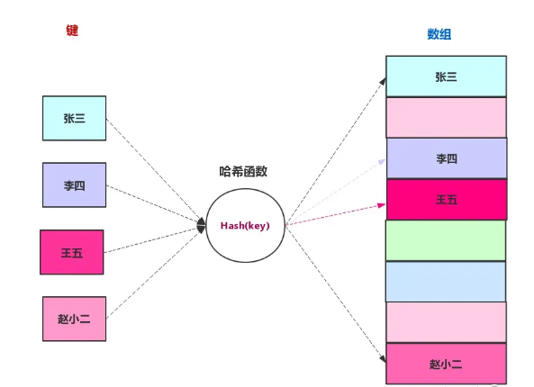
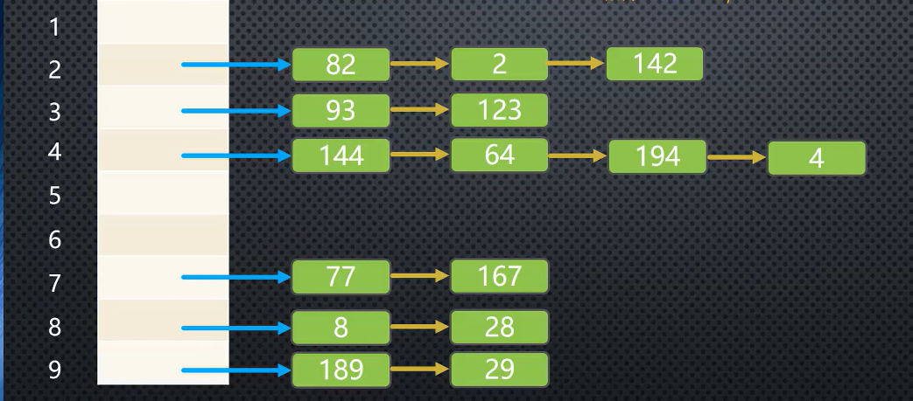

## 1.哈希表
1. 哈希表：哈希表是一种基于数组的数据结构，通过哈希函数将key值转化成下标值，然后将value填入对应的下标，所以哈希表的插入和查找非常快。但是哈希表也有自己的缺点当装填因子（实际使用数组的长度除以总长度），当装填影子大于0.75是需要扩容，小于0.25时需要减容


2. 哈希冲突：由于通过哈希表是一种基于数组的数据结构，当字符串经过哈希化转换成下标后，可能会重复，这就导致了同一个下标位置可能存在多个值，这就是所谓的哈希冲突，解决哈希冲突的办法由链地址法和开放地址法
3. 链地址法：对用小标处不直接放入value，先放入一个对象或数组然后再把value放入对应的对象和数组中.


4.开放地址法又分为线性探测、二次探测、再哈希化
- 线性探测：当遇到下标已经存在值时，此时需要向后查找空白区域，如果找到空白区域后就放进去，但是会数据会发生聚集的现象，这个时候每次插入就需要经过多次的线性探测
- 二次探测

## 2.哈希函数与哈希化
1. 哈希化：将大数字转化成小数字
2. 哈希函数：将单词转化成大数字，大数字再进行哈希化，这个过程实现的函数就叫做哈希函数


## 3.连地址法封装哈希表
1. hashFunc：哈希函数
2. put：添加元素
3. get：获取元素
3. remove：删除元素
4. resize：扩容
```js
class HashTable {
  constructor() {
    // 属性
    this.storage = []
    // 数量
    this.count = 0
    this.limit = 7
    this.loadFactor = 0 // 装填因子
  }
  hashFunc(str, size) {
    let hashCode = 0
    for (let i = 0; i < str.length; i++) {
      hashCode = 37 * hashCode + str.charCodeAt(i)
    }
    let index = hashCode & size
    return index
  }
  // 添加元素
  put(key, value) {
    // 是否需要扩容

    // 获取下标
    const index = this.hashFunc(key, this.limit)
    // 查询链表该出是否已经存在数据
    let target = this.storage[index]
    // 如果没有则添加
    if (!target) {
      this.storage[index] = target = {}
    }
    if (!target[key]) {
      this.count++

    }
    // 判断target是否已经存在key，如果存在分覆盖，没有则添加
    target[key] = value
    this.loadFactor = (this.count) / this.limit
    console.log(this.loadFactor)
    if (this.loadFactor > 0.75) {
      console.log(this.loadFactor)
      this.resize(this.getPrime(this.limit * 2))
    }
  }
  // 获取元素
  get(key) {
    // 获取下标
    const index = this.hashFunc(key, this.limit)
    // 查询链表该出是否已经存在数据
    let target = this.storage[index]
    if (!target) return -1
    return target[key]
  }
  // 删除
  remove(key) {
    // 获取下标
    const index = this.hashFunc(key, this.limit)
    // 查询链表该出是否已经存在数据
    let target = this.storage[index]
    // 没有返回false，有则删除并返回true
    if (!target) return false
    if (target.hasOwnProperty(key)) {
      this.count--
    }
    delete target[key]
    this.loadFactor = this.count / this.limit
    // 减容
    if (this.limit > 7 && this.loadFactor < 0.25) {
      this.resize(this.getPrime(this.limit / 2))
    }
    return true
  }
  // 扩容
  resize(limit) {
    const oldStorage = this.storage
    this.storage = []
    this.count = 0
    this.limit = limit
    this.loadFactor = 0
    for (let i = 0; i < oldStorage.length; i++) {
      const target = oldStorage[i]
      if (!target) {
        continue
      }
      for (let key in target) {
        this.put(key, target[key])
      }
    }
  }
  // 判断质数
  isPrime(number) {
    for (let i = 2; i < number; i++) {
      if (number % i == 0) {
        return false
      }
    }
    return true
  }
  // 获取质数
  getPrime(number) {
    let isPrimed = this.isPrime(number)
    if (isPrimed) {
      return number
    }
    while (!isPrimed) {
      number += 1
      isPrimed = this.isPrime(number)
    }
    return number
  }
}
```