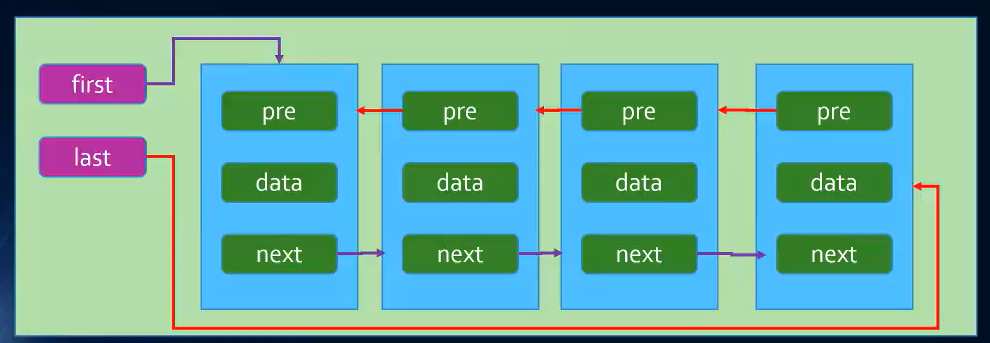

1. 链表是一种数据结构，链表中的元素在内存中不连续的空间，分为单项链表和双向链表

2. 单项链表：它的每个元素由一个存储元素本身的节点和一个指向下一个元素的引用组成，只有尾指针
- append：在末尾添加一个元素
- toString：把所有内容以字符串的方式展示
- insert：在某个位置插入元素
- get：获取某个位置元素的值
- indexOf：返回某个元素的索引值
- update：修改处于某个位置元素的值
- removeAt：根据位置移除某个元素
- move：根据值移除某个元素
- isEmpty：判断链表是否为空
- size：返回链表的长度


3. 双向链表：它的每个元素由一个存储元素本身的节点和一个指向下一个元素的引用与指向上一个元素的引用组成，具有尾指针



## 1.单向链表的封装
```js
class Node {
  constructor(data) {
    this.data = data
    this.next = null
  }
}
class LinkList {
  constructor() {
    this.head = null
    this.length = 
  }
  // 添加
  append(data) {
    const node = new Node(data)
    if (this.length == 0) {
      this.head = node
    } else {
      // 找到没有next的node就是最后一个node
      let cur = this.head
      while (cur.next) {
        cur = cur.next
      }
      cur.next = node
    }
    this.length++
  }
  // 把所有内容以字符串的方式展示
  toString() {
    let str = ''
    let cur = this.head
    while (cur) {
      str += cur.data
      cur = cur.next
    }
    return str
  }
  // 插入
  insert(position, data) {
    // 边界判断
    if (position > this.length || position < 0) return false
    const node = new Node(data)
    if (position == 0) {
      let after = this.head
      this.head = node
      node.next = after
    } else {
      let cur = this.head
      while (position-- > 1) {
        cur = cur.next
        // position--
      }
      console.log(cur)
      // 从cur分隔开
      let after = cur.next
      // cur的next是node
      cur.next = node
      // node的next是之前cur的next
      node.next = after
    }
    this.length++
  }
  // 获取某个位置的data
  get(position) {
    if (position > this.length || position <= 0) return false
    let cur = this.head
    while (position > 1) {
      cur = cur.next
      position--
    }
    return cur.data
  }
  // 返回索引,没找到返回-1
  indexOf(data) {
    let index = 0
    let cur = this.head
    while (cur.data !== data) {
      index+
      cur = cur.next
      if (!cur) {
        index = -1
        break
      }
    }
    return index
  }
  // 修改某个位置的数据
  update(position, data) {
    if (position > this.length || position <= 0) return false
    let cur = this.head
    while (position > 1) {
      cur = cur.next
      position--
    }
    cur.data = data
  }
  // 根据位置移除某个元素
  removeAt(position) {
    if (position > this.length || position == 0) return false
    if (position == 1) {
      this.head = this.head.next
    } else {
      let cur = this.head
      let previous
      while (position > 1) {
        previous = cur
        cur = cur.nex
        position--
      }
      console.log(cur, previous)
      previous.next = cur.next
    }
    this.length--
  }
  // 通过值删除某个元素
  move(data) {
    const index = this.indexOf(data)
    return this.removeAt(index)
  }
  // 是否为空
  isEmpty() {
    return this.length == 0 ? true : false
  }
  // size
  size() {
    return this.length
  }
}
```