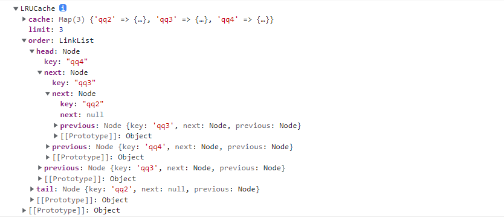

1. 链表是一种数据结构，链表中的元素在内存中不连续的空间，分为单项链表和双向链表,链表的特点插入和删除很快，但是查找慢(遍历)，所以，理论上，在需要经常插入节点、删除节点，而且数据量比较大的场合，非常适合使用链表。

2. 单项链表：它的每个元素由一个存储元素本身的节点和一个指向下一个元素的引用组成，只有尾指针
- append：在末尾添加一个元素
- toString：把所有内容以字符串的方式展示
- insert：在某个位置插入元素
- get：获取某个位置元素的值
- indexOf：返回某个元素的索引值
- update：修改处于某个位置元素的值
- removeAt：根据位置移除某个元素
- move：根据值移除某个元素
- isEmpty：判断链表是否为空
- size：返回链表的长度


3. 双向链表：它的每个元素由一个存储元素本身的节点和一个指向下一个元素的引用与指向上一个元素的引用组成，具有尾指针


## 1.单向链表的封装
```js
class Node {
  constructor(data) {
    this.data = data
    this.next = null
  }
}
class LinkList {
  constructor() {
    this.head = null
    this.length = 
  }
  // 添加
  append(data) {
    const node = new Node(data)
    if (this.length == 0) {
      this.head = node
    } else {
      // 找到没有next的node就是最后一个node
      let cur = this.head
      while (cur.next) {
        cur = cur.next
      }
      cur.next = node
    }
    this.length++
  }
  // 把所有内容以字符串的方式展示
  toString() {
    let str = ''
    let cur = this.head
    while (cur) {
      str += cur.data
      cur = cur.next
    }
    return str
  }
  // 插入
  insert(position, data) {
    // 边界判断
    if (position > this.length || position < 0) return false
    const node = new Node(data)
    if (position == 0) {
      let after = this.head
      this.head = node
      node.next = after
    } else {
      let cur = this.head
      while (position-- > 1) {
        cur = cur.next
        // position--
      }
      console.log(cur)
      // 从cur分隔开
      let after = cur.next
      // cur的next是node
      cur.next = node
      // node的next是之前cur的next
      node.next = after
    }
    this.length++
  }
  // 获取某个位置的data
  get(position) {
    if (position > this.length || position <= 0) return false
    let cur = this.head
    while (position > 1) {
      cur = cur.next
      position--
    }
    return cur.data
  }
  // 返回索引,没找到返回-1
  indexOf(data) {
    let index = 0
    let cur = this.head
    while (cur.data !== data) {
      index+
      cur = cur.next
      if (!cur) {
        index = -1
        break
      }
    }
    return index
  }
  // 修改某个位置的数据
  update(position, data) {
    if (position > this.length || position <= 0) return false
    let cur = this.head
    while (position > 1) {
      cur = cur.next
      position--
    }
    cur.data = data
  }
  // 根据位置移除某个元素
  removeAt(position) {
    if (position > this.length || position == 0) return false
    if (position == 1) {
      this.head = this.head.next
    } else {
      let cur = this.head
      let previous
      while (position > 1) {
        previous = cur
        cur = cur.nex
        position--
      }
      console.log(cur, previous)
      previous.next = cur.next
    }
    this.length--
  }
  // 通过值删除某个元素
  move(data) {
    const index = this.indexOf(data)
    return this.removeAt(index)
  }
  // 是否为空
  isEmpty() {
    return this.length == 0 ? true : false
  }
  // size
  size() {
    return this.length
  }
}
```


## 2.双向链表的封装


## 3.链表的应用
1. LRU 缓存淘汰算法
- LRU算法是一种缓存淘汰策略，它选择最近最少使用的数据进行淘汰，比如计算机可以缓存3种app的数据，首先分别先后使用了A,B,C三种app，现在有个Dapp需要使用在，则需要删除A,B,C里面的一种，根据优先程度应应该删除的是你最开始使用的app，则应该删除C，而Dapp是目前你最优先使用的app所以应该放在最前面为D，A,B。此时你正在使用D时，刚还需要进入A软件看一下，则A就需要进入优先级最该排名为A,D,B。
- 所以设计时，该类需要一个put用于添加软件，get用于在某某软件已存在时再次调用调整优先级
- 下面具体看看怎么工作
```js
// 缓存容量为 2
lruCache = new LRUCache(2);
// 可以看做队列
lruCache.put(1, 1) // [(1, 1)]
lruCache.put(2, 2) // [(2, 2), (1, 1)]
lruCache.put(3, 3) // [(3, 3), (2, 2)]
// 键已存在
lruCache.put(2, 4) // [(2, 4), (3, 3)]
```
2. LRU缓存淘汰算法数据结构封装
```js
class Node {
  constructor(key) {
    this.key = key
    this.next = null
    this.previous = null
  }
}
class LinkList {

  constructor() {
    this.head = null;
    this.tail = null;
  }
  addToHead(key) {
    let node = new Node(key)
    if (!this.head) {
      this.head = this.tail = node
    } else {
      let preHead = this.head
      this.head = node
      node.next = preHead
      preHead.previous = node
    }
    return node
  }
  removeLast() {
    let key = this.tail.key
    let last = this.tail.previous
    last.next = null
    this.tail = last
    return key
  }
  moveToHead(node) {

    // console.log(node === this.head)
    // // 如果是第一个
    if (node === this.head) return
    // 如果是最后一个
    if (node == this.tail) {
      let head = this.head
      this.head = node
      node.next = head
      head.previous = node
      let lats = this.tail

      this.tail = lats.previous
      this.tail.next = null
    } else {
      // 不是最后一个
      // 前指针
      node.previous.next = node.next
      // 后指针
      node.next.previous = node.previous
      let head = this.head
      this.head = node
      node.next = head
      head.previous = node
    }
  }
}
class LRUCache {
  constructor(limit) {
    this.limit = limit
    this.cache = new Map()
    this.order = new LinkList()
  }
  put(key, value) {
    // 添加
    if (!this.cache.has(key)) {
      // 不超过最大限制
      const node = this.order.addToHead(key)
      this.cache.set(key, { value, node })
      // 超过最大限制
      if (this.cache.size > this.limit) {
        const removeKey = this.order.removeLast()
        this.cache.delete(removeKey)
      }
    } else {
      // 再次调用，删除自己把自己放最前面
      let node = this.cache.get(key).node
      this.order.moveToHead(node)
      console.log(node)

    }
  }
  get(key) {
    if (this.cache.has(key)) {
      this.order.moveToHead(this.cache.get(key).node)
      return this.cache.get(key).value
    }
    return -1
  }
}
let lru = new LRUCache(3)
lru.put('qq1', 1)
lru.put('qq2', 2)
lru.put('qq3', 3)
lru.put('qq3', 4)
lru.put('qq4', 1)
lru.put('qq3', 2)
lru.get('qq4')
console.log(lru)
```

3. 结果如下

