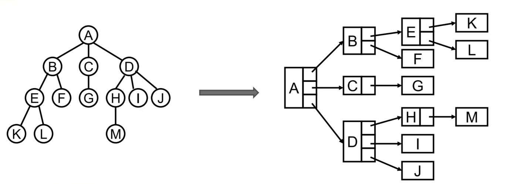
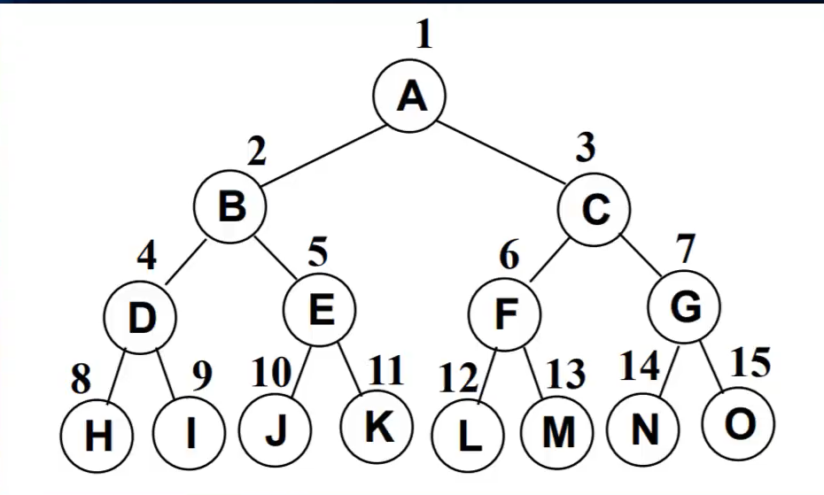

## 1.树结构
1. 树结构：树结构是一种层次化的数据结构，它由节点组成，节点之间通过边连接。树的特点是每个节点都有一个父节点（除了根节点），而可能有多个子节点。树结构常用于表示层次关系，例如文件系统、组织结构、XML/HTML文档等。
- 根节点： 树的顶部节点，没有父节点。它是树的起始点。
- 叶节点： 没有子节点的节点，位于树的末端。
- 父节点： 有子节点的节点是其子节点的父节点。
- 子节点： 一个节点的直接后代节点。
- 兄弟节点： 具有相同父节点的节点。
- 深度： 从根节点到当前节点的唯一路径的边数。
- 高度： 从当前节点到其最远叶节点的路径的边数。
- 子树： 由一个节点及其所有后代节点组成的树。
- 祖先节点： 从根节点到某个节点路径上的所有节点。
- 后代节点： 从某个节点到其所有子孙节点的路径上的所有节点。



## 2.二叉树
1. 二叉树：二叉树是一种特殊的树结构，其中每个节点最多有两个子节点，分别称为左子节点和右子节点。这些子节点必须遵循特定的顺序：左子节点的值小于父节点的值，右子节点的值大于父节点的值.
- 根节点： 树的顶部节点，没有父节点。
- 节点： 二叉树中的基本单元，包含一个值和指向左右子节点的引用。
- 左子节点和右子节点： 每个节点最多有两个子节点，分别位于左侧和右侧。
- 叶节点： 没有子节点的节点。
- 深度： 从根节点到当前节点的唯一路径的边数。
- 高度： 从当前节点到其最远叶节点的路径的边数。
- 父节点和子节点关系： 每个节点除了根节点外，都有一个父节点。
- 空节点： 二叉树中节点的子节点可能为空，即没有左子节点或右子节点。



2. 二叉树类型
- 二叉搜索树： 一种特殊的二叉树，其中左子节点的值小于父节点的值，右子节点的值大于父节点的值。这种排序和结构特性使得在BST中搜索、插入和删除等操作效率较高。
- 平衡二叉树： 一种高效的二叉树，确保树的左右子树的高度差不超过某个固定的值，从而保持树的高度较小，提高了搜索等操作的性能。
- 满二叉树： 每个节点要么没有子节点，要么恰好有两个子节点。


## 3.二叉搜索树（Binary Search Tree，BST）
1. 二叉搜索树的封装
- insert(key): 向树中插入一个新的键
- has(key): 在树中查找一个键，如果节点存在，则返回true ;如果不存在，则返回false. 
- bfs: 广度优先搜索。
- travelsal: 深度优先搜索(先序遍历，中序遍历，后续遍历)
- postOrderTraverse: 通过后序遍历方式遍历所有节点
- getMin : 返回树中最小的值/键
- getMax : 返回树中最大的值/键
- remove(key): 从树中移除某个键。
```js
class Node {
  constructor(key) {
    this.key = key
    this.left = null
    this.right = null
  }
}
class BinarySearchTree {
  constructor() {
    this.root = null
  }
  insert(key) {
    const node = new Node(key)
    // 没有根节点
    if (!this.root) {
      this.root = node
    } else {
      // 有根节点
      this.travelsalInsert(this.root, node)
    }
  }
  travelsalInsert(preNode, node) {
    // 左树
    if (preNode.key > node.key) {
      // 左树为空时node则直接赋值左树
      if (!preNode.left) {
        preNode.left = node
      } else {
        // 又把左树当做顶点继续比较
        this.travelsalInsert(preNode.left, node)
      }
    } else {
      // 右数
      if (!preNode.right) {
        preNode.right = node
      } else {
        this.travelsalInsert(preNode.right, node)
      }
    }
  }
  // 遍历(深度优先搜索)
  travelsal(handler) {
    this.travelsalVisit(this.root, handler)
  }
  travelsalVisit(node, handler) {
    if (!node) return false
    // 先序遍历
    handler(node.key)
    if (node.left) {
      // 中序遍历
      // handler(node.key)
      this.travelsalVisit(node.left, handler)
    }
    if (node.right) {
      // 中序遍历
      // handler(node.key)
      this.travelsalVisit(node.right, handler)
    }
    // 后序遍历
    // handler(node.key)
  }
  // 广度优先搜索
  bfs(handler) {
    // 思路也是一样的，定义一个队列，把最根放入队列，当访问的时候取出来，如果
    // 访问这个节点相连还有其它节点时继续放进队列，一直到队列的长度为0
    let queue = [this.root]
    // 也可所以使用递归
    while (queue.length) {
      let cur = queue.shift()
      if (cur.left) {
        queue.push(cur.left)
      }
      if (cur.right) {
        queue.push(cur.right)
      }
      handler(cur.key)
    }
  }
  // 获取小大值
  getMin() {
    let root = this.root
    let res
    while (root.left) {
      root = root.left
      res = root.key
    }
    return res
  }
  // 获取最大值
  getMax() {
    let root = this.root
    let res
    while (root.right) {
      root = root.right
      res = root.key
    }
    return res
  }
  // 判断是否存在
  has(key) {
    let root = this.root
    while (root) {
      if (root.key > key) {
        root = root.left
      } else if (root.key < key) {
        root = root.right
      } else {
        return true
      }
    }
    return false
  }
  // 删除操作
  remove(key) {
    // 先找到node及node的父亲
    const nodeObj = this.find(this.root, key)
    const { self, parent, isLeft } = nodeObj
    console.log(nodeObj)
    // 叶子节点
    if (!self.left && !self.right) {
      if (isLeft) {
        parent.left = null
      } else {
        parent.right = null
      }
    }
    // 单节点
    if (!self.left || !self.right) {
      if (isLeft) {
        parent.right = self.left || self.right
      } else {
        parent.left = self.left || self.right
      }
    }
    // 双节点
    if (self.left && self.right) {
      // 父节点是单节点
      if (!parent.left || !parent.right) {
        parent.left = self.left
        parent.right = self.right
      }
      // 父亲是双节点
      if (parent.left && parent.right) {
        if (isLeft) {
          let left = parent.left = self.right
          // 一直往后找
          while (left.left) {
            left = left.left
          }
          left.left = self.left
        } else {
          let right = parent.right = self.right
          while (right.right) {
            right = right.right
          }
          right.right = self.left
        }
      }
    }
  }
  // 找到并返回某个节点
  find(root, key) {
    return this.travelsalFind(root, key)
  }
  // 递归寻找
  travelsalFind(root, key, parent) {
    if (root.key === key) {
      return {
        self: root,
        parent,
        isLeft: parent.key < key ? true : false
      }
    } else if (root.key > key) {
      return this.travelsalFind(root.left, key, root)
    } else {
      return this.travelsalFind(root.right, key, root)
    }
    return false
  }
}
```