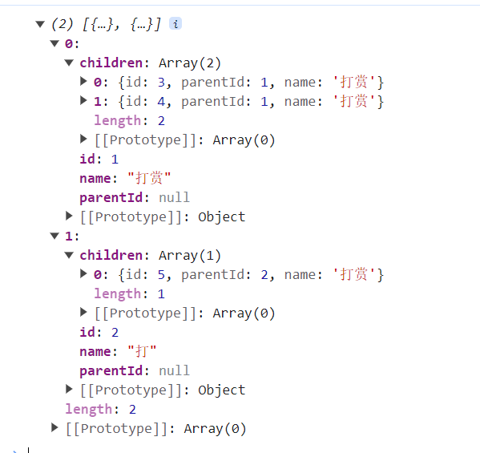

1. 在工作经常遇到树形数据与扁平数据的转化，比如菜单类型的的需求与递归组件

## 1.扁平数据树形化

1. 将扁平化的数据转化成树形，通常每个数据中含有一个自身的id及父亲id，通过自身id与父id确定父子关系

- 通过创建父子关系的列表实现,时间复杂度为0(2n)
```js
function flattenToTree(flatArray) {
  const tree = [];
  const lookup = {}
  // 创建查找表
  for (const item of flatArray) {
    lookup[item.id] = { ...item, children: [] };
  }
  console.log(lookup)
  // 构建树
  for (const item of flatArray) {
    if (item.parentId !== null) {
      // 找到父亲
      const parent = lookup[item.parentId];
      if (parent) {
        // 父亲存在则放自己进去
        parent.children.push(lookup[item.id]);
      }
    } else {
      tree.push(lookup[item.id]);
    }
  }
  console.log(tree)
  return tree;
}
```

- 通过递归实现,时间复杂度O(n^2)
```js
function flattenToTree(flatArray) {
  const parnet = arr.filter(item => !item.parentId),
    children = arr.filter(item => item.parentId

  function toTree(parnet, children) {
    parnet.forEach(p => {
      children.forEach((c, i) => {
        if (p.id === c.parentId) {
          const _children = JSON.parse(JSON.stringify(children))
          _children.splice(i, 1)
          toTree([c], _children)
          if (!p.children) {
            p.children = [c]
          } else {
            p.children.push(c)
          }
        }
      })
    })
  }
  toTree(parnet, children)
  return parnet
}

let arr = [
  {
    id: 1,
    parentId: null,
    name: '打赏'
  },
  {
    id: 2,
    parentId: null,
    name: '打'
  },
  {
    id: 3,
    parentId: 1,
    name: '打赏'
  },
  {
    id: 4,
    parentId: 1,
    name: '打赏'
  },
  {
    id: 5,
    parentId: 2,
    name: '打赏'
  }
]
console.log(flattenToTree(arr))
```

- 结果如下



## 2.树形数据扁平化
- 使用递归
```js
function TreeToFlatten(data,arr =  []) {
  data.forEach(item => {
    if (item.children && item.children.length > 0) {
      TreeToFlatten(item.children, arr)
    }
    delete item.children
    arr.push(item)
  })
  return arr
}
```


