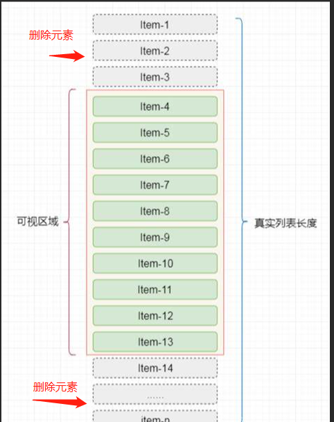

## 1.虚拟列表是什么
1. 虚拟列表是一种优化列表渲染性能的技术，可以在处理大量数据时提高页面的渲染效率和内存占用,在工作中当我们遇到一些不能使用分页的情况来加载的业务时，比如外汇交易系统中，列表无线浏览时。
2. 虚拟列表的原理：在固定高度的可视区域渲染列表项
- 确定开始渲染项与结束渲染项的下标，进行渲染
- 监听滚动事件，重新计算渲染项
- 删除不需要渲染的渲染项




## 2. 虚拟列表实现
- html部分
```html
<!DOCTYPE html>
<html lang="en">
<head>
  <meta charset="UTF-8">
  <meta http-equiv="X-UA-Compatible" content="IE=edge">
  <meta name="viewport" content="width=device-width, initial-scale=1.0">
  <title>Document</title>
  <style>
    #container {
      height: 300px;
      position: relative;
      overflow: auto;
      border: 1px solid black;
    }
    .item-list {
      position: absolute;
      border: 1px solid gray;
      width: 100%;
    }
  </style>
</head>
<body>
  <div id="container">
    <div id="list"></div>
  </div>
  <script src="index.js"></script>
</body>
</html>
```
- js部分
```js
 let container = document.getElementById('container')
        list =  document.getElementById('list'),
        startIndex = 0, // 开始项
        itemHeight = 50, // 每个渲染项高度
        gap = 7, // 需要渲染的数据
        lastIndex = startIndex + gap, // 结束项
        total = 20, // 渲染总数
        map = new Map()
    function createItem(index) {
      let item = document.createElement('div')
      item.className = 'item-list'
      item.innerHTML = 'item' + index
      item.style.height = itemHeight + 'px'
      item.style.top = (index * itemHeight) + 'px'
      return item
    }
    function renderList() {
      for(let i = startIndex; i < lastIndex; i++) {
        if(!map.has(i)) {
          item = createItem(i)
          list.appendChild(item)
          map.set(i, item)
        }
      }
      
      container.appendChild(list)
    
    }
    container.addEventListener('scroll', updateLiat)
    function delItem() {
      console.log(map)
      map.forEach((item, index) => {
 
        if (index < startIndex || index > lastIndex) {
          list.removeChild(item)
          map.delete(index)
        }
      })
      // const ll = document.getElementsByClassName('item-list')
      // for(let i = 0; i< startIndex; i++) {
      //   list.removeChild(ll[i])
      // }
      console.log(map)
    }
    function updateLiat(e) {
      const scrollTop = e.srcElement.scrollTop
      // 计算
      startIndex = Math.max(0, Math.floor((scrollTop / itemHeight)))
      lastIndex = Math.min(startIndex + gap, total)
      // console.log(startIndex, lastIndex)
      renderList()
      delItem()
    }
    renderList()
```


## 3. 插件形式封装
- container 最外层容器
- list 渲染的容器
- itemHeight 每个选项高度
- gap 每次渲染的数量
- total 渲染项的总数

```js
(function () {
  class VirtualList {
    constructor(options) {
      const { container, list, itemHeight, gap, total } = options
      this.container = document.getElementById(container)
      this.list = document.getElementById(list)
      this.itemHeight = itemHeight
      this.gap = gap
      this.total = total
      this.startIndex = 0
      this.lastIndex = this.startIndex + this.gap
      this.map = new Map()
      this.init()
    }
    init() {
      this.renderList()
      this.container.addEventListener('scroll', this.update.bind(this))
    }
    // 渲染
    renderList() {
      for (let i = this.startIndex; i < this.lastIndex; i++) {
        if (!this.map.has(i)) {
          let item = this.createItem(i)
          this.list.appendChild(item)
          this.map.set(i, item)
        }
      }
    }
    // 创建item
    createItem(index) {
      let item = document.createElement('div')
      item.className = 'item-list'
      item.innerHTML = 'item' + index
      item.style.height = this.itemHeight + 'px'
      item.style.top = (index * this.itemHeight) + 'px'
      return item
    }
    // 更新
    update(e) {
      const scrollTop = e.srcElement.scrollTop
      this.startIndex = Math.max(0, Math.floor((scrollTop / this.itemHeight)))
      this.lastIndex = Math.min(this.startIndex + this.gap, this.total)
      this.renderList()
      this.delList()
    }
    // 删除
    delList() {
      this.map.forEach((item, index) => {
        if (index < this.startIndex || index > this.lastIndex) {
          this.list.removeChild(item)
          this.map.delete(index)
        }
      })
    }
  }
  window.VirtualList = VirtualList
})();
```
- 使用
```html
<!DOCTYPE html>
<html lang="en">

<head>
  <meta charset="UTF-8">
  <meta http-equiv="X-UA-Compatible" content="IE=edge">
  <meta name="viewport" content="width=device-width, initial-scale=1.0">
  <title>Document</title>
  <style>
    #container {
      height: 300px;
      position: relative;
      overflow: auto;
      border: 1px solid black;
    }

    .item-list {
      position: absolute;
      border: 1px solid gray;
      width: 100%;
    }
  </style>
</head>

<body>
  <div id="container">
    <div id="list"></div>
  </div>
  <script src="./index.js"></script>
  <script>
    const virtualList = new VirtualList({
      container: 'container',
      list: 'list', 
      itemHeight: 50,
      gap: 7,
      total: 20,
    })
  </script>
</body>

</html>
```