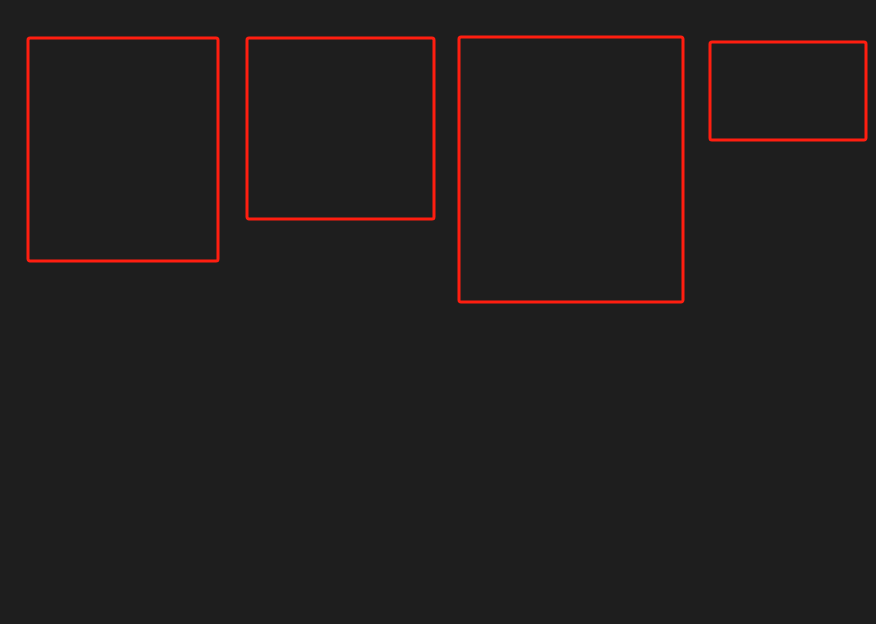
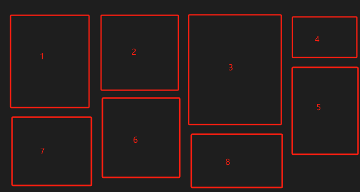
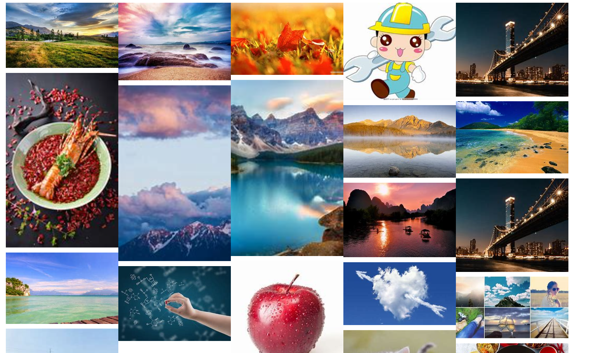

- 1.瀑布流（Waterfall Flow）是一种页面布局方式，通常用于展示多个项目或内容块，这些项目的高度和宽度可以不同

## 1.瀑布流原理
1. 通过img实现瀑布流，当存在许多张图片时，每一行图片的图片数目确定，及宽度确定。
2. 容器相对定位，每张图片绝对定位，第一行图片top值固定，left值为每张图片宽度加上一个偏移的间隔，得到后如下

3. 此时确定第二行，需要在高度最低的地方加入一张图片，把第一行图片的高度放进一个数组
4. 确定第二行图片的top和left值即可确定位置，top为第一行高度最矮的offetHeight加上间隔值，left值就为该项的left
5. 最后数组中被修改的项保存的item累加


## 2.简单瀑布流实现
1. html结构如下
```html
<!DOCTYPE html>
<html lang="en">

<head>
  <style>
    .container {
      width: 1200px;
      position: relative;
    }
    .item {
      width: 200px;
      position: absolute;
    }
  </style>
</head>

<body>
  <div class="container">
    
    
    
    
    
    
    
    
    
    
    
    
    
    
    
    
    
    
    
    
    
  </div>
  <script src="./index.js"></script>
</body>

</html>
```
2. js部分
- 立即执行函数触发
- 按照原理一步一步实现即可
```js
((document) => {
  const items = document.getElementsByClassName('item')
  const length = items.length
  const _arr = [] // item高度
  function init() {
    for (let i = 0; i < length; i++) {
      const item = items[i]
      const width = (1200 - 40) / 5
      item.style.width = width + 'px'
      if (i < 5) {
        const height = item.offsetHeight
        _arr.push(height)
        item.style.top = 0
        item.style.left = (i * width + 10) + 'px'
      } else {
        const minIndex = getMinIndex(_arr)
        item.style.top = (_arr[minIndex] + 10) + 'px'
        item.style.left = items[minIndex].offsetLeft + 'px'
        _arr[minIndex] += (item.offsetHeight + 10)
      }
    }
  }
  function getMinIndex(arr) {
   return arr.indexOf(Math.min(...arr))
  }
  window.onload = function () {
    init()
  }
})(document);
```

3. 效果图如下



## 3. 插件形式封装
1. 插件部分
- 插件部分，立即执行自执行，在window上挂载构造函数
- 配置部分，column一行多少张图片， gap间隔，el外部容器
- renderImg进行渲染
```js
(function () {
  function getMinIndex(arr) {
    return arr.indexOf(Math.min(...arr))
  }
  class WtaterFlow {
    constructor(optiopns) {
      const { column, gap, el } = optiopns
      this.column = column
      this.gap = gap
      this.container = document.getElementsByClassName(el)[0]
      this.imgs = []
      this._arr = []
      this.items = []
      this.i = 0

    }
    renderImg(imgs) {
      imgs.forEach((img, i) => {
        const oItem = document.createElement('img'),
          width = (this.container.offsetWidth - (this.column - 1) * this.gap) / this.column,
          height = (img.height * width) / img.width
        oItem.className = 'item'

        // const img = new Image()
        oItem.src = img.src
        oItem.style.width = width + 'px'
        oItem.style.height = height + 'px'
        this.items.push(oItem)
        this.container.appendChild(oItem)
        if (this.i < this.column) {
          this._arr.push(oItem.offsetHeight)
          console.log(oItem.offsetHeight)

          oItem.style.top = 0
          if (this.i == 0) {
            oItem.style.left =0
          } else {
            oItem.style.left = (this.i * width + this.gap) + 'px'
          }
         
        } else {
          const minIndex = getMinIndex(this._arr)
          // console.log(minIndex)
          oItem.style.top = (this._arr[minIndex] + this.gap) + 'px'
          oItem.style.left = this.items[minIndex].offsetLeft + 'px'
          this._arr[minIndex] += (oItem.offsetHeight + this.gap)
        }
        this.i++
      })
      console.log(this._arr)
    }
    addImg(imgs) {
      // this.imgs.push(...imgs)
      this.renderImg(imgs)
    }
  }
  window.WtaterFlow = WtaterFlow
})()
```

2. 使用
```js
const waterFlow = new WtaterFlow({
  column: 2,
  gap: 10,
  el: 'container'
}
// 接口返回
function fetch(num) {
  getImg(num).then(res => {
    waterFlow.addImg(res)
    console.log(waterFlow)
  })
}
fetch(0)
window.onscroll = function () {
  // 当页面滚动到底部时触发加载更多内容的函数
  if (document.documentElement.scrollHeight - window.innerHeight === window.scrollY) {
    loadMoreContent();
  }
}
function loadMoreContent() {
  console.log('触底，加载更多内容');
  fetch(1)
}

```

