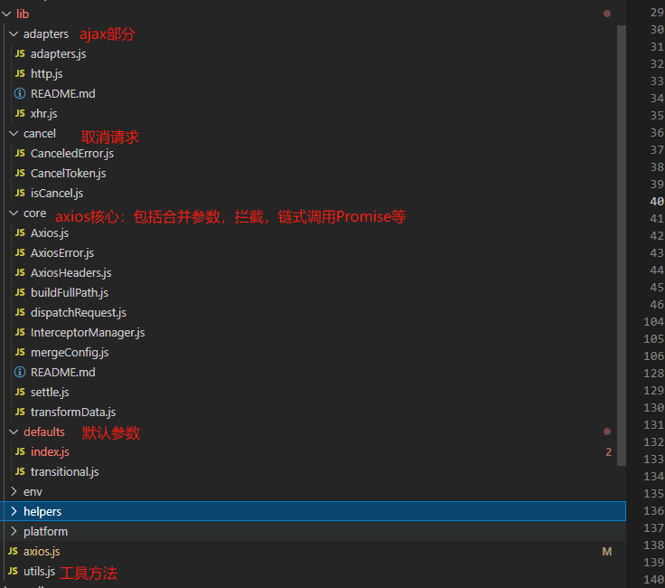

1. axios源码由axios入口，核心模块，请求与响应拦截器，适配器（一般来讲为ajax）等组成



2. axios是函数createInstance创建的一个实例，并且在该实例上挂载了create,CancelToken,all等方法,函数createInstance及axios实例如下
```js
function createInstance(defaultConfig) {
  const context = new Axios(defaultConfig);
  const instance = bind(Axios.prototype.request, context);
  // 把Axios.prototype上的方法添加到instance上
  utils.extend(instance, Axios.prototype, context, {allOwnKeys: true});
   // 把实例上的属性添加到instance上
  utils.extend(instance, context, null, {allOwnKeys: true});
  // 添加create方法
  instance.create = function create(instanceConfig) {
    // 合并新的选项
    return createInstance(mergeConfig(defaultConfig, instanceConfig));
  };
  return instance;
}
// Create the default instance to be exported
const axios = createInstance(defaults);
axios.Axios = Axios;

// Expose Cancel & CancelToken
axios.CanceledError = CanceledError;
axios.CancelToken = CancelToken;
axios.isCancel = isCancel;
// 最后导出
export default axios
```

3. core和心中的Axios.js提供了构造函数Axios
```js
class Axios {
  constructor(instanceConfig) {
    // 实例属性
    this.defaults = instanceConfig;
    this.interceptors = {
      request: new InterceptorManager(),
      response: new InterceptorManager()
    };
  }
```
4. 在Axios原型上绑定请求方法
```js
utils.forEach(['post', 'put', 'patch'], function forEachMethodWithData(method) {
  /*eslint func-names:0*/
  function generateHTTPMethod(isForm) {
    return function httpMethod(url, data, config) {
      return this.request(mergeConfig(config || {}, {
        method,
        headers: isForm ? {
          'Content-Type': 'multipart/form-data'
        } : {},
        url,
        data
      }));
    };
  }
  // 原型上添加方法
  Axios.prototype[method] = generateHTTPMethod();
  Axios.prototype[method + 'Form'] = generateHTTPMethod(true);
});
```
5. 所有的方法都会集中在request方法中处理，此时会合并参数,收集请求拦截和相应拦截
```js
  request(configOrUrl, config) {
    /**
     * 合并参数
     * axios('url', {})
     * axios({})
    */
    if (typeof configOrUrl === 'string') {
      config = config || {};
      config.url = configOrUrl;
    } else {
      config = configOrUrl || {};
    }

    // 合并默认配置与传入的配置
    config = mergeConfig(this.defaults, config);
    // 设置请求方法，默认get
    config.method = (config.method || this.defaults.method || 'get').toLowerCase();
    let contextHeaders;
    // 合并headers
    contextHeaders = headers && utils.merge(
      headers.common,
      headers[config.method]
    );
    // 删除header上的其他方法
    contextHeaders && utils.forEach(
      ['delete', 'get', 'head', 'post', 'put', 'patch', 'common'],
      (method) => {
        delete headers[method];
      }
    );
    // headers上只保存了contextHeaders
    config.headers = AxiosHeaders.concat(contextHeaders, headers);
    // filter out skipped interceptors
    // 获取请求拦截器
    const requestInterceptorChain = [];
    let synchronousRequestInterceptors = true;
    
    this.interceptors.request.forEach(function unshiftRequestInterceptors(interceptor) {
      requestInterceptorChain.unshift(interceptor.fulfilled, interceptor.rejected);
    });
    // 获取响应拦截器
    const responseInterceptorChain = [];
    this.interceptors.response.forEach(function pushResponseInterceptors(interceptor) {
      responseInterceptorChain.push(interceptor.fulfilled, interceptor.rejected);
    });

    let promise;
    let i = 0;
    let len;
    // 传入拦截器走这里
    if (!synchronousRequestInterceptors) {
      const chain = [dispatchRequest.bind(this), undefined];
      // 把请求拦截器与相应拦截器添加到chain里
      // [requestSuccess, requestErr,dispatchRequest.bind(this), undefined,responseSuccess, responseErr]
      chain.unshift.apply(chain, requestInterceptorChain);
      chain.push.apply(chain, responseInterceptorChain);
      len = chain.length;
      // 必定成功的peomise
      promise = Promise.resolve(config);
      // 链条执行promise
      while (i < len) {
        promise = promise.then(chain[i++], chain[i++]);
      }
      return promise;
    }

    // 后续不在执行，这里是不传入拦截器走的
    len = requestInterceptorChain.length;

    let newConfig = config;

    i = 0;

    while (i < len) {
      const onFulfilled = requestInterceptorChain[i++];
      const onRejected = requestInterceptorChain[i++];
      try {
        newConfig = onFulfilled(newConfig);
      } catch (error) {
        onRejected.call(this, error);
        break;
      }
    }

    try {
      // 执行dispatchRequest
      promise = dispatchRequest.call(this, newConfig);
    } catch (error) {
      return Promise.reject(error);
    }
    i = 0;
    len = responseInterceptorChain.length;
    while (i < len) {
      promise = promise.then(responseInterceptorChain[i++], responseInterceptorChain[i++]);
    }
    return promise;
  }
```


6. 关于请求拦截和响应拦截的Promise链


```js
const chain = [dispatchRequest.bind(this), undefined];
// 当没有请求拦截时
promsie = dispatchRequest.bind(this)() // 发起请求
promise.then() // 拿到响应结果

// 当存在请求拦截或者响应拦截时
// 获取请求拦截器
const requestInterceptorChain = [];
let synchronousRequestInterceptors = true;
this.interceptors.request.forEach(function unshiftRequestInterceptors(interceptor) {
  // 成功回调，失败回调
  requestInterceptorChain.unshift(interceptor.fulfilled, interceptor.rejected);
});
// 获取响应拦截器
const responseInterceptorChain = [];
this.interceptors.response.forEach(function pushResponseInterceptors(interceptor) {
  // 成功回调，失败回调
  responseInterceptorChain.push(interceptor.fulfilled, interceptor.rejected);
});
// 请求拦截添加在前
chain.unshift.apply(chain, requestInterceptorChain);
chain.push.apply(chain, responseInterceptorChain);
// 最后得到的chain
const chain = [resolveQuest, rejectQuest, dispatchRequest.bind(this), undefined, resolveResponse, rejectResponse];
// 通过循环得到最后的promise
while(chain.length > 0) {
  promise = promise.then(chain.shift(), chain.shift())
}
```


7. ajax请求
```js
function xhrAdapter(config) {
  let xhr
  const { url, method, params, cancelToken } = config
  // 简单的ajax封装
  return new Promise((resolve, reject) => {
    xhr = new XMLHttpRequest()
    xhr.onreadystatechange = function () {
      if (xhr.readyState === 4) {
        if ((xhr.status >= 200 && xhr.status < 300)) {
          resolve(1)
        }
      }
    }
    xhr.open(method, url, true)
    xhr.send()
    if (cancelToken) {
      console.log(cancelToken)
      cancelToken.promise.then(() => {
        // 存在cancelToken时取消请求，resolvePromise调用时触发
        console.log('取消请求')
        xhr.abort()
      }, () => {
      })
    }
  })
};
```

8.cancelToken取消请求,在config传入时new CancelToken((c) => can = c), can会被赋值成回调函数function cancel() { resolvePromise() }，当can执行时can()，resolvePromise()执行，返回成功的Promise，此时在xhrAdapter中调用xhr.abort()，取消请求完成
```js
class CancelToken {
  constructor(executor) {
    // 执行器函数必须是函数
    if (typeof executor !== 'function') {
      throw new TypeError('executor must be a function.');
    }
    let resolvePromise;
    this.promise = new Promise((resolve) => {
      resolvePromise = resolve;
    });
    executor(function cancel() {
      resolvePromise();
    });
  }
}
```