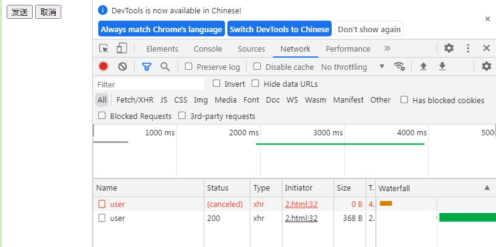

1. 完成自己的简易的axios，需要提供5个模块，
- createInstance：该函数用于创建axios实例
- Axios：导出的axios实例
- InterceptorManager：管理请求拦击和响应拦截
- fetch： 该方法用于ajax请求
- CancelToken： 取消网络请求

2. createInstance方法：创建一个axios实例并返回
```js
function createInstance() {
  let axios = new Axios
  // 在原型上绑定get,post方法，该方法调用的是axios原型上的request方法
  Array.from(['get', 'post']).forEach(method => {
    Axios.prototype[method] = Axios.prototype.request
  })
  // 绑定CancelToken类用于取消请求
  axios.cancelToken = CancelToken
  return axios
}
```

3. Axios核心，包含合并参数，收集请求拦截响应拦截，链式处理连接promise,发起ajax请求
```js
class Axios {
  constructor() {
    this.interceptors = {
      request: new InterceptorManager(),
      response: new InterceptorManager()
    }
  }
  request(config) {
    // 判断参数并合并
    if (typeof config === 'string') {
      config = arguments[1] || {};
      config.url = arguments[0];
    } else {
      config = config || {};
    }
    let promise = Promise.resolve(config)
    let dispatchChain = [fetch, undefined]
    // 收集请求拦截，放在dispatchChain的前面
    this.interceptors.request.handlers.forEach(interceptor => {
      dispatchChain.unshift(interceptor.resolve, interceptor.reject)
    })
    // 收集响应拦截，放在dispatchChain的后面
    this.interceptors.response.handlers.forEach(interceptor => {
      dispatchChain.push(interceptor.resolve, interceptor.reject)
    })
    // 链式调用
    while (dispatchChain.length > 0) {
      promise = promise.then(dispatchChain.shift(), dispatchChain.shift())
    }
    return promise
  }
}
```


4.InterceptorManager
```js
class InterceptorManager {
  constructor() {
    this.handlers = []
  }
  // 通过use将拦截放进handlers
  use(resolve, rejected) {
    this.handlers.push({
      resolve,
      rejected
    })
  }
}
```


5.fetch:ajax的请求模块，通过xhr.abort取消请求
```js
function fetch(config) {
  let xhr
  const { url, method, params, cancelToken } = config
  console.log(cancelToken)
  const promise = new Promise((resolve, reject) => {
    xhr = new XMLHttpRequest()
    console.log(xhr)
    xhr.onreadystatechange = function () {
      if (xhr.readyState === 4) {
        if ((xhr.status >= 200 && xhr.status < 300)) {
          resolve(xhr.response)
        } else {
          resolve('失败')
        }
      }
    }
    xhr.open(method, url, true)
    xhr.send() 
  })
  // 取消请求
  if (cancelToken) {
    cancelToken.promise.then(() => {
      xhr.abort()
    }) 
    return promise
  }
}
```


6.CancelToken：取消请求
```js
class CancelToken {
  constructor(exctor) {
    let resolvePromise
    this.promise = new Promise(resolve => {
      resolvePromise = resolve
    })
    // cancel传出去的回调函数 
    exctor(function cancel() {
      resolvePromise()
    })
  }
}
```

7.一个完整的示例如下
前台部分
```html
<!DOCTYPE html>
<html lang="en">

<head>
  <meta charset="UTF-8">
  <meta http-equiv="X-UA-Compatible" content="IE=edge">
  <meta name="viewport" content="width=device-width, initial-scale=1.0">
  <title>Document</title>
</head>
<button id="send">发送</button>
<button id="cancal">取消</button>

<body>
  <script>
    function fetch(config) {
      let xhr
      const { url, method, params, cancelToken } = config
      console.log(cancelToken)
      const promise = new Promise((resolve, reject) => {
        xhr = new XMLHttpRequest()
        console.log(xhr)
        xhr.onreadystatechange = function () {
          if (xhr.readyState === 4) {
            if ((xhr.status >= 200 && xhr.status < 300)) {
              resolve(xhr.response)
            } else {
              resolve('失败')
            }
          }
        }
        xhr.open(method, url, true)
        xhr.send();

      })
      // 取消请求
      if (cancelToken) {
        cancelToken.promise.then(() => {
          xhr.abort()
        })
      }

      return promise
    }
    class Axios {
      constructor() {
        this.interceptors = {
          request: new InterceptorManager(),
          response: new InterceptorManager()
        }
      }
      request(config) {
        // 判断参数并合并
        if (typeof config === 'string') {
          config = arguments[1] || {};
          config.url = arguments[0];
        } else {
          config = config || {};
        }
        let promise = Promise.resolve(config)
        let dispatchChain = [fetch, undefined]
        // 收集请求拦截
        this.interceptors.request.handlers.forEach(interceptor => {
          dispatchChain.unshift(interceptor.resolve, interceptor.reject)
        })
        // 收集响应拦截
        this.interceptors.response.handlers.forEach(interceptor => {
          dispatchChain.push(interceptor.resolve, interceptor.reject)
        })
        while (dispatchChain.length > 0) {
          promise = promise.then(dispatchChain.shift(), dispatchChain.shift())
        }
        return promise
      }
    }
    class InterceptorManager {
      constructor() {
        this.handlers = []
      }
      use(resolve, rejected) {
        this.handlers.push({
          resolve,
          rejected
        })
      }
    }
    class CancelToken {
      constructor(exctor) {
        let resolvePromise
        this.promise = new Promise(resolve => {
          resolvePromise = resolve
        })
        // cancel传出去的回调函数 
        exctor(function cancel() {
          resolvePromise()
        })
      }
    }
    function createInstance() {
      let axios = new Axios
      Array.from(['get', 'post']).forEach(method => {
        Axios.prototype[method] = Axios.prototype.request
      })
      axios.cancelToken = CancelToken
      return axios
    }
    
    
    
    let send = document.getElementById('send')
    let cancel = document.getElementById('cancal')
    const axiso = createInstance()
    const cancelToken = axiso.cancelToken
    axiso.interceptors.request.use(config => {
      return config
    })
    axiso.interceptors.response.use(config => {
      return config
    })
    let can
    send.addEventListener('click', () => {
      axiso.get({
        url: 'http://127.0.0.1:8089/user',
        method: 'get',
        params: {
          a: 1,
        },
        cancelToken: new cancelToken(function cancel(c) {
          can = c
        })
      }).then(res => {
        console.log(res)
      }, err => {
        console.log(err)
      })
    })
    cancel.addEventListener('click', () => {
      can()
    })

  </script>
</body>

</html>
```
node部分
```js
const express = require('express');
const app = express();
function delayResponse(req, res, next) {
    const delayTime = 2000; 
    setTimeout(next, delayTime);
}
// 使用延迟中间件
app.use(delayResponse);
app.use(function (req, res, next) {
    res.header("Access-Control-Allow-Origin", "*");
    res.header("Access-Control-Allow-Methods", "GET, POST, PUT, DELETE");
    res.header("Access-Control-Allow-Headers", "Content-Type");
    next();
});
app.get('/user', (req, res) => {
    res.send('Hello world');
});
app.listen(8089, () => {
    console.log('Server is running at http://127.0.0.1:8089')
})
```
完成

8. github地址:  <https://github.com/cleverMountain/axios>
