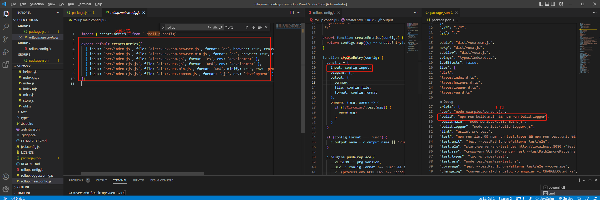
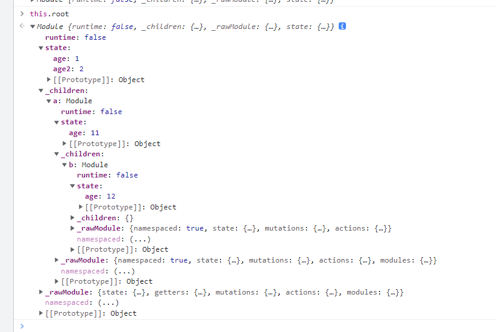
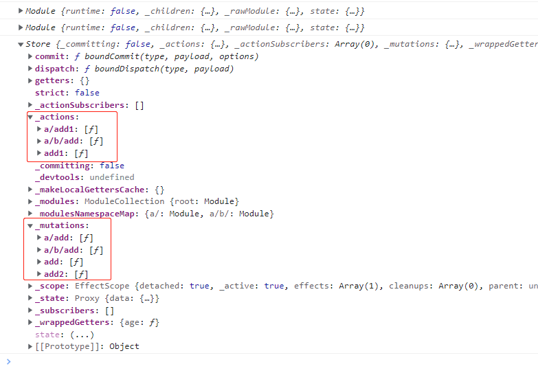

1. vuex是vue提供的状态管理，提供了install(app.use时触发安装该插件),mapState, mapMutations, mapGetters, mapActions等辅助函数，其中构造函数Store是状态管理的核心

2. 打开package.json通过buiild时，找到rollup的打包入口,根据不同的index.js得到不同支持不同环境的输出文件，包括esModule生产环境，esModule开发环境环境,commonJsumd等


3. 入口文件index.js
```js
export default {
  Store, // 状态管理核心
  install, // app.use时触发该方法并安装vuex插件
  version: '__VERSION__',
  // 辅助管理
  mapState,
  mapMutations,
  mapGetters,
  mapActions,
}
```

4. store.js,状态管理的核心主要由五个部分组成
- _modules： 收集各个模块
- _mutations： 收集commit函数
- _actions： 收集dispatch函数
- state：管理库数据
```js
export class Store {
  constructor (options = {}) {
    this._actions = Object.create(null)
    this._mutations = Object.create(null)
    this._wrappedGetters = Object.create(null)
    // 收集模块
    this._modules = new ModuleCollection(options) 
    // 安装模块
    installModule(this, state, [], this._modules.root)
  }
}
```

5. 通过new ModuleCollection来收集各个模块，各模块通过new Module得到
- 通过path决定路径，默认传入path = [],此时根就等于最开始传入的模块
- 之后通过递归的方式连续注册子模块
- _children为子模块， _rawModule当前模块

```js
export default class Module {
  constructor (rawModule) {
    this._children = Object.create(null)
    this._rawModule = rawModule
    this.state = rawModule.state
  }
  // 添加child，找到父亲后添加自己为儿子调用
  addChild (key, module) {
    this._children[key] = module
  }
  // 获取当前的child，获取父亲是使用
  getChild (key) {
    return this._children[key]
  }

}
export default class ModuleCollection {
  constructor (rawRootModule) {
    this.register([], rawRootModule, false)
  }
  get (path) {
    return path.reduce((module, key) => {
      return module.getChild(key)
    }, this.root)
  }
  register (path, rawModule, runtime = true) {
    // Module的构造函数
    const newModule = new Module(rawModule, runtime)
    if (path.length === 0) {
      // 当path为[]是就是根组件
      this.root = newModule
    } else {
      // 找到父亲
      const parent = this.get(path.slice(0, -1))
      // 给父亲添加自己为儿子
      parent.addChild(path[path.length - 1], newModule)
    }

    if (rawModule.modules) {
      forEachValue(rawModule.modules, (rawChildModule, key) => {
        // 拼接path
        this.register(path.concat(key), rawChildModule, runtime)
      })
    }
  }
}
```
收集modules后得到的modules模块



6.模块收集完毕之后，开始安装模块installModule
- 遍历注册mutation
- 遍历注册action
- 遍历注册getter
- 递归安装module
```js
// module原型上的方法
function installModule (store, rootState, path, module, hot) {
  // 遍历注册mutation
  module.forEachMutation((mutation, key) => {
    const namespacedType = namespace + key
    registerMutation(store, namespacedType, mutation, local)
  })
  // 遍历注册action
  module.forEachAction((action, key) => {
    const type = action.root ? key : namespace + key
    const handler = action.handler || action
    registerAction(store, type, handler, local)
  })
  // 遍历注册getter
  module.forEachGetter((getter, key) => {
    const namespacedType = namespace + key
    registerGetter(store, namespacedType, getter, local)
  })
  // 递归安装module, 如果module._childen存在继续安装module
  module.forEachChild((child, key) => {
    installModule(store, rootState, path.concat(key), child, hot)
  })
}
```
安装完之后得到



7.在Store原型上添加commit函数与dispatch函数，用于修改状态
```js
store.prptotype.commit = (type, payload) => {
  const mutation = { type, payload }
  const entry = this._mutations[type]
  entry.forEach(function commitIterator (handler) {
    handler(payload)
  })
}
store.prptotype.dispatch =  (type, payload) => {
  const mutation = { type, payload }
  const entry = this._actions[type]
  entry.forEach(function diapatchIterator (handler) {
    handler(payload)
  })
}
```